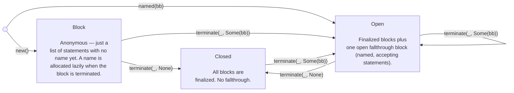
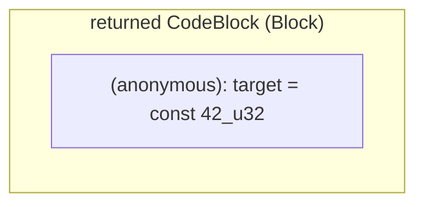
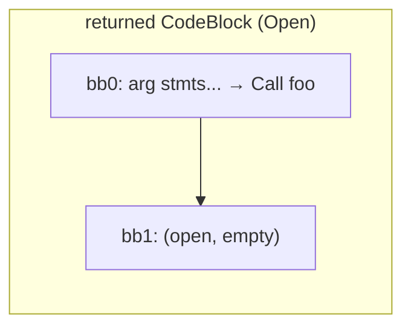
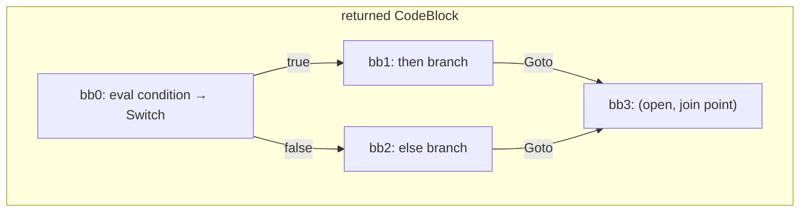
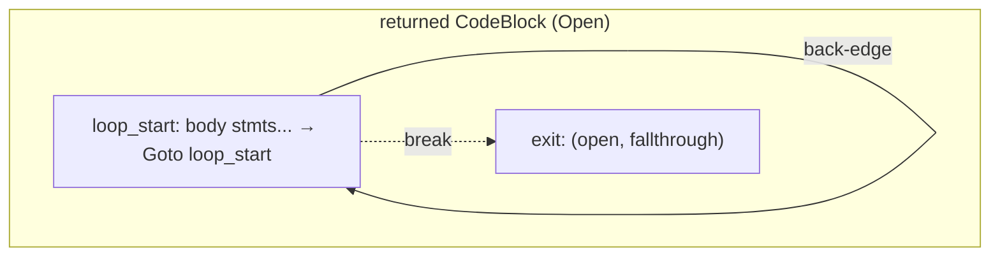

# Code generation

The `codegen` module translates the high-level expression grammar into MiniRust basic blocks. Its entry point is `codegen_function`, which takes a function body (a `Block`) and produces a `lang::Function` containing a map of basic blocks, local variables, and an entry point.

## CodeBlock: the control-flow builder

The core abstraction is **`CodeBlock`** — a *single-entry, multi-exit* control-flow code block that is incrementally constructed. It is an enum with three variants representing the builder's state:

{anchor}`CodeBlock`

### Lifecycle

A code block starts as an anonymous `Block` (just accumulating statements) and transitions to named states (`Open` / `Closed`) once it needs basic-block structure:

`Block` is the starting state for simple expressions — statements accumulate without allocating any basic-block names. Most expressions stay in `Block` and get inlined into their parent via `append`. Once a terminator is needed (a call, branch, or explicit control flow), `terminate` names the block and transitions to `Closed` or `Open`.

`Open` is the state for regions that already have named blocks. Statements accumulate into the named fallthrough block. `terminate` finalizes the fallthrough and either closes the code block or opens a new fallthrough.

Once a code block is `Closed`, mutations (`with_stmt`, `terminate`) are no-ops. This naturally handles dead code after `return` or `break`. However, `terminate` with `Some(next_bb)` on a `Closed` code block will re-open it — this is used for blocks reachable via `break` that aren't continuations of the previous terminator.

### Core operations

| Operation | Effect |
|-----------|--------|
| `with_stmt(s)` | Appends a statement to the current fallthrough (Block or Open) |
| `terminate(t, None)` | Finalizes the fallthrough block → Closed |
| `terminate(t, Some(bb))` | Finalizes the fallthrough block, opens `bb` as the new fallthrough → Open |
| `append(other)` | Sequential composition (see below) |
| `into_blocks()` | Extracts the final `Map<BbName, BasicBlock>` |

### The `append` operation

`append` is how sequential composition works. Its behavior depends on whether `other` is anonymous or named:

| self | other | Behavior |
|------|-------|----------|
| Block | Block | Concatenate statements (both anonymous — no names needed) |
| Block | Open/Closed | Name self, emit Goto to other's entry, merge other's blocks |
| Open | Block | Extend fallthrough with other's statements |
| Open | Open/Closed | Emit Goto from fallthrough to other's entry, merge other's blocks |

The key invariant: **once a block is named, it is never destroyed**. When appending a named code block (Open or Closed), its entry block is preserved as a jump target — `append` emits a Goto to it rather than inlining it. This ensures that blocks referenced by jumps (loop headers, break targets) always survive in the final map.

### Compound helpers

These methods on `CodegenFn` combine `terminate` with block allocation:

| Helper | What it does |
|--------|-------------|
| `call(code block, fn, args, ret)` | Allocates `next_bb`, terminates with `Call { next_block: next_bb }` and opens `next_bb` |
| `branch_on_bool_from(code block, cond, then, else)` | Allocates a `join_bb`, terminates with Switch, absorbs both branches, opens `join_bb` |
| `build_loop(loop_start, exit, body)` | Creates a named code block at `loop_start`, appends body, back-edge to `loop_start`, opens `exit` |

## Judgments

### `codegen_block`

The top-level block codegen creates a fresh code block, then appends each statement's code block in sequence:

{judgment}`codegen_block`

### `codegen_stmt`

Each statement produces a `CodeBlock` that gets appended to the enclosing block's code block:

{judgment}`codegen_stmt`

### `codegen_expr_into`

Expressions are compiled into a target local. Each rule returns a `CodeBlock`:

{judgment}`codegen_expr_into`

## Walkthrough: literal expression

The simplest case — a literal like `42_u32`:

{judgment-rule}`codegen_expr_into, literal`

1. `fresh_code_block()` creates a `CodeBlock::Block { stmts: [] }` (anonymous)
2. `.assign(target, constant(42, u32))` pushes one `Assign` statement → still `Block { stmts: [assign] }`

The caller appends this single-block code block into its own code block. Since it's just a `Block`, append concatenates the statements directly — no basic-block names are allocated.

## Walkthrough: function call

A function call like `foo(a, b)` is more interesting:

{judgment-rule}`codegen_expr_into, call`

1. Fresh code block starts as `Block { stmts: [] }`
2. For each argument, `codegen_expr_into` returns a Block, and `append` concatenates its statements
3. `.call(...)` allocates `next_bb`, terminates with `Call { next_block: next_bb }` → **Open** with `next_bb` as fallthrough

The caller can now append more work into bb1.

## Walkthrough: if/else

An `if b { ... } else { ... }` statement:

{judgment-rule}`codegen_stmt, if`

1. Codegen the condition into a temp (`cond_region` — typically a Block)
2. Codegen both branches independently (each returns its own CodeBlock)
3. `branch_on_bool_from` terminates cond_region with a Switch, absorbs both branches, and opens a join block

If both branches diverge (e.g., both `return`), there is no join block — the result is `Closed`.

## Walkthrough: loop

A `'label: loop { body }`:

{judgment-rule}`codegen_stmt, loop`

The `build_loop` helper constructs:

1. `CodeBlock::named(loop_start)` — starts in Open state at loop_start
2. Append the body code block (emits Goto from parent fallthrough into loop_start)
3. If body has fallthrough, terminate with `Goto(loop_start)` back-edge and open `exit`
4. If body diverges, open `exit` anyway (reachable via `break`)

A `break 'label` compiles to `terminate(Goto(exit_block))`, directing control to the exit.

When this loop code block is appended into the parent, the parent's fallthrough block gets a Goto to `loop_start` — since `loop_start` is a named block, `append` preserves it as a jump target rather than inlining it.

## Putting it all together

The final step is `build_function`, which:

1. If the body code block still has fallthrough, appends a unit assignment + Return terminator
2. Extracts the entry block name
3. Calls `into_blocks()` to get the final `Map<BbName, BasicBlock>`
4. Prepends `StorageLive` statements to the entry block for all non-argument locals
5. Returns a `lang::Function` ready for MiniRust interpretation
